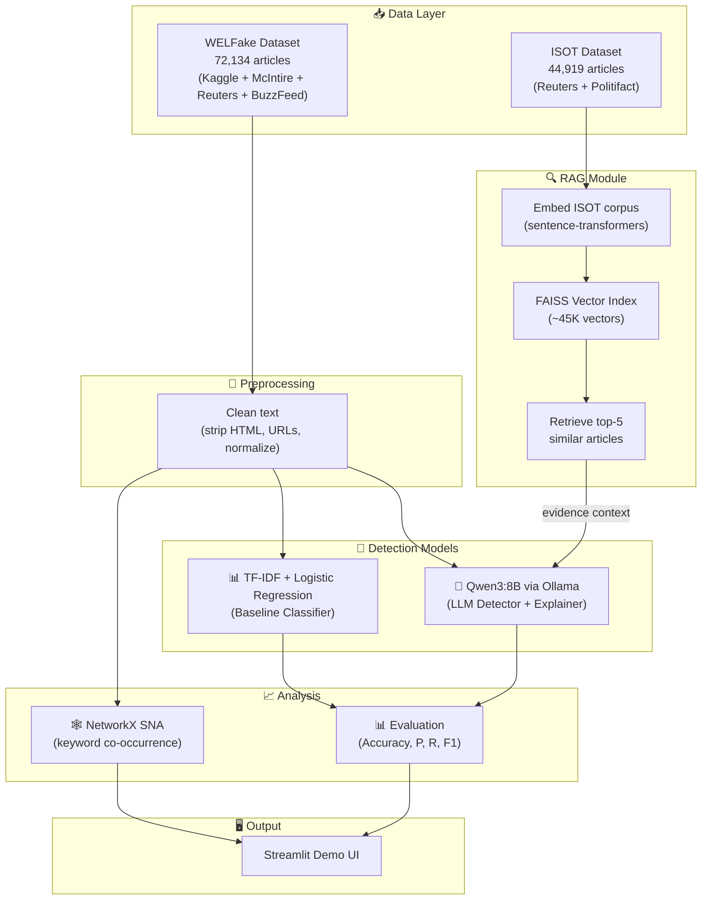
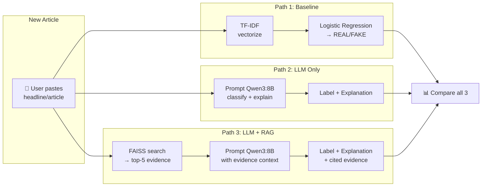

# Explainable Fake News Detection System — Final Plan

## Project Objective

Build an **explainable, lightweight, fully offline fake-news detection pipeline** that:
1. Detects fake news using **linguistic and stylistic patterns** via both classical ML and LLM approaches
2. Provides **natural-language explanations** for every verdict (not just a label)
3. Reduces **LLM hallucination** by grounding judgments against a retrieved evidence corpus (RAG)
4. Surfaces **structural patterns** in misinformation through social network analysis
5. Delivers a **reproducible, low-cost, privacy-preserving** system with no cloud/API dependency

> [!IMPORTANT]
> **Scope boundary**: The system detects fake news by recognizing linguistic patterns and verifying against known claims. Real-time verification of completely novel breaking events is explicitly **out of scope** (proposed as future work).

---

## Final Decisions

| Decision | Choice | Rationale |
|----------|--------|-----------|
| **Main Dataset** | WELFake (72,134 articles) | Multi-source, diverse, less biased than single-source datasets |
| **RAG Corpus** | ISOT Fake News (44,919 articles) | Separate source — proves cross-dataset retrieval generalization |
| **LLM** | Qwen3:8B via Ollama | Best reasoning + explanation quality; thinking mode for chain-of-thought |
| **Baseline** | TF-IDF + Logistic Regression | Standard, interpretable, fast baseline for comparison |
| **Embeddings** | `all-MiniLM-L6-v2` (sentence-transformers) | Lightweight, fast, good quality for semantic search |
| **Vector Store** | FAISS (faiss-cpu) | Fastest local vector search, no server needed |
| **SNA** | NetworkX + matplotlib | Keyword co-occurrence graphs with centrality metrics |
| **Demo UI** | Streamlit | Quick to build, interactive, supports visualization |

---

## Architecture



---

## Data Flow (Detailed)



---

## Phased Execution Plan

### Phase 1 — Project Setup & Data Ingestion
**Goal:** Clean project structure, both datasets loaded and preprocessed.

#### [NEW] [requirements.txt](file:///Users/keshavdokania/Desktop/WEB%20MINIng/requirements.txt)
```
pandas
numpy
scikit-learn
sentence-transformers
faiss-cpu
networkx
matplotlib
seaborn
streamlit
ollama
tqdm
beautifulsoup4
regex
```

#### [NEW] [data_ingestion.py](file:///Users/keshavdokania/Desktop/WEB%20MINIng/data_ingestion.py)
- Load **WELFake** (`WELFake_Dataset.csv`) — add label column if needed
- Load **ISOT** (`Fake.csv` + `True.csv`) — merge and label
- Text cleaning pipeline:
  - Strip HTML tags (BeautifulSoup)
  - Remove URLs, email addresses
  - Remove emojis and special characters
  - Normalize whitespace and case
  - Drop duplicates and empty rows
  - Drop rows with missing `text`
- Split WELFake → 80% train/test (stratified)
- Save cleaned data to `data/cleaned/`
- Save ISOT cleaned corpus to `data/rag_corpus/`

**Output files:**
```
data/cleaned/train.csv       # WELFake 80% for training
data/cleaned/test.csv        # WELFake 20% for evaluation
data/rag_corpus/isot.csv     # Full ISOT dataset for RAG
```

---

### Phase 2 — TF-IDF Baseline Classifier
**Goal:** Establish baseline accuracy with classical ML.

#### [NEW] [baseline_model.py](file:///Users/keshavdokania/Desktop/WEB%20MINIng/baseline_model.py)
- Load `data/cleaned/train.csv` and `data/cleaned/test.csv`
- TF-IDF vectorization (`max_features=10000`, `ngram_range=(1,2)`)
- Train Logistic Regression classifier
- Optionally train Random Forest for comparison
- Evaluate on test set:
  - Accuracy, Precision, Recall, F1-score
  - Confusion matrix
  - Classification report
- Save trained model to `models/tfidf_logreg.pkl`
- Save results to `results/baseline_results.json`

**Expected:** F1 > 0.90 (typical for TF-IDF on fake news datasets)

---

### Phase 3 — LLM-Based Detection (Qwen3:8B)
**Goal:** Classify articles using LLM with natural-language explanations.

#### [NEW] [llm_detector.py](file:///Users/keshavdokania/Desktop/WEB%20MINIng/llm_detector.py)
- Connect to Ollama local API (`localhost:11434`)
- Sample **300 articles** from test set (balanced: 150 real + 150 fake)
- For each article, send structured prompt:
  ```
  You are a fake news detection expert. Analyze the following news article 
  and classify it as REAL or FAKE.

  Article: {text[:1500]}

  Respond in EXACTLY this format:
  Label: REAL or FAKE
  Explanation: [One concise sentence explaining your reasoning]
  ```
- Parse response → extract label + explanation
- Handle edge cases (malformed responses, timeouts)
- Compute accuracy, precision, recall, F1 vs ground truth
- Save results to `results/llm_results.json`
- Save per-article predictions to `results/llm_predictions.csv`

**Expected:** F1 ~0.75-0.85 (LLM without evidence context)

---

### Phase 4 — RAG Module
**Goal:** Ground LLM judgments against retrieved evidence to reduce hallucination.

#### [NEW] [rag_module.py](file:///Users/keshavdokania/Desktop/WEB%20MINIng/rag_module.py)

**Step 1 — Build Index (one-time):**
- Load ISOT corpus from `data/rag_corpus/isot.csv`
- Chunk articles (first 500 chars of each article as the chunk)
- Embed all chunks using `all-MiniLM-L6-v2`
- Build FAISS index (`IndexFlatIP` — inner product for cosine similarity)
- Save index to `models/faiss_index.bin`
- Save chunk metadata to `models/chunk_metadata.pkl`

**Step 2 — Query (per article):**
- Embed the test article
- Retrieve top-5 most similar chunks from ISOT corpus
- Build augmented prompt:
  ```
  You are a fake news detection expert. Analyze the following article 
  and classify it as REAL or FAKE.

  Here is relevant evidence from known fact-checked articles:
  Evidence 1: {chunk_1} [Label: {label_1}]
  Evidence 2: {chunk_2} [Label: {label_2}]
  ...

  Article to classify: {text[:1500]}

  Respond in EXACTLY this format:
  Label: REAL or FAKE
  Explanation: [Cite the evidence that supports your judgment]
  ```
- Run on same 300 test articles as Phase 3
- Compare LLM+RAG vs LLM-only vs Baseline
- Save results to `results/rag_results.json`

**Expected:** F1 improvement of 3-8% over LLM-only

---

### Phase 5 — Social Network Analysis
**Goal:** Surface structural patterns in misinformation through graph analysis.

#### [NEW] [sna_analysis.py](file:///Users/keshavdokania/Desktop/WEB%20MINIng/sna_analysis.py)
- Load WELFake dataset
- Extract top-20 TF-IDF keywords per article
- Build **keyword co-occurrence graph**:
  - Nodes = keywords
  - Edges = co-occurrence in same article (weighted by frequency)
  - Separate graphs for REAL vs FAKE articles
- Compute metrics:
  - Degree centrality
  - Betweenness centrality
  - PageRank
- Identify top-20 most central keywords in fake vs real news
- Visualize with matplotlib:
  - Network graph (top 50 nodes)
  - Centrality comparison bar chart (fake vs real)
- Save graphs to `results/sna_*.png`

---

### Phase 6 — Evaluation & Comparison
**Goal:** Comprehensive comparison of all approaches.

#### [NEW] [evaluation.py](file:///Users/keshavdokania/Desktop/WEB%20MINIng/evaluation.py)
- Load results from all phases
- Generate comparison table:

  | Model | Accuracy | Precision | Recall | F1 |
  |-------|----------|-----------|--------|-----|
  | TF-IDF + LogReg | — | — | — | — |
  | Qwen3:8B (LLM only) | — | — | — | — |
  | Qwen3:8B + RAG | — | — | — | — |

- Generate visualizations:
  - Bar chart comparing F1 scores
  - Confusion matrices (side by side)
  - ROC curves (for baseline)
- Qualitative analysis: sample 10 LLM explanations, compare with/without RAG
- Export everything to `results/`

---

### Phase 7 — Streamlit Demo UI
**Goal:** Interactive interface for classifying pasted headlines.

#### [NEW] [app.py](file:///Users/keshavdokania/Desktop/WEB%20MINIng/app.py)
- **Input:** Text area to paste headline or article
- **Model selector:** Toggle between Baseline / LLM / LLM+RAG
- **Output:**
  - REAL/FAKE label (with color-coded badge)
  - Confidence score (for baseline)
  - Natural-language explanation (for LLM modes)
  - Retrieved evidence passages (when RAG is on)
- **Dashboard tab:**
  - Evaluation metrics comparison table
  - F1 score bar chart
  - SNA graph visualization
- Clean, dark-themed UI

---

## Final Project Structure

```
WEB MINIng/
├── Project Title.docx          # Original project document
├── requirements.txt            # Python dependencies
├── data_ingestion.py           # Phase 1: Load & clean data
├── baseline_model.py           # Phase 2: TF-IDF + LogReg
├── llm_detector.py             # Phase 3: Qwen3:8B detection
├── rag_module.py               # Phase 4: RAG pipeline
├── sna_analysis.py             # Phase 5: Network analysis
├── evaluation.py               # Phase 6: Compare all models
├── app.py                      # Phase 7: Streamlit demo
│
├── data/
│   ├── raw/                    # Original dataset files
│   │   ├── WELFake_Dataset.csv
│   │   ├── Fake.csv            # ISOT
│   │   └── True.csv            # ISOT
│   ├── cleaned/
│   │   ├── train.csv           # WELFake 80%
│   │   └── test.csv            # WELFake 20%
│   └── rag_corpus/
│       └── isot.csv            # Cleaned ISOT for RAG
│
├── models/
│   ├── tfidf_logreg.pkl        # Saved baseline model
│   ├── tfidf_vectorizer.pkl    # Saved TF-IDF vectorizer
│   ├── faiss_index.bin         # FAISS vector index
│   └── chunk_metadata.pkl      # RAG chunk metadata
│
└── results/
    ├── baseline_results.json
    ├── llm_results.json
    ├── llm_predictions.csv
    ├── rag_results.json
    ├── comparison_table.csv
    ├── f1_comparison.png
    ├── confusion_matrices.png
    └── sna_*.png
```

---

## Prerequisites Checklist

- [ ] **Download WELFake** from [Kaggle](https://www.kaggle.com/datasets/saurabhshahane/fake-news-classification) → place `WELFake_Dataset.csv` in `data/raw/`
- [ ] **Download ISOT** from [Kaggle](https://www.kaggle.com/datasets/clmentbisaillon/fake-and-real-news-dataset) → place `Fake.csv` and `True.csv` in `data/raw/`
- [ ] **Install Ollama**: `brew install ollama`
- [ ] **Pull Qwen3:8B**: `ollama pull qwen3:8b`
- [ ] **Python 3.9+** with pip

---

## Verification Plan

### Automated Checks
| Check | Command | Expected |
|-------|---------|----------|
| Data ingestion | `python data_ingestion.py` | Creates train.csv, test.csv, isot.csv |
| Baseline model | `python baseline_model.py` | F1 > 0.90 |
| LLM detector | `python llm_detector.py` | Parses all 300 responses, F1 > 0.70 |
| RAG module | `python rag_module.py` | Retrieves relevant evidence, F1 > LLM-only |
| SNA analysis | `python sna_analysis.py` | Generates graph PNGs |
| Evaluation | `python evaluation.py` | Generates comparison table + charts |
| Streamlit demo | `streamlit run app.py` | Serves UI on localhost:8501 |

### Manual Verification
- Paste 10 known fake/real headlines → verify labels and explanations
- Compare LLM vs LLM+RAG explanations for same articles
- Verify SNA graphs show meaningful keyword clusters

---

## Estimated Timeline

| Phase | Task | Est. Time |
|-------|------|-----------|
| 1 | Setup + Data Ingestion | 30 min |
| 2 | Baseline Model | 30 min |
| 3 | LLM Detector (300 articles × ~5s) | 1.5-2 hrs |
| 4 | RAG Module (index build + 300 queries) | 1.5-2 hrs |
| 5 | SNA Analysis | 30 min |
| 6 | Evaluation | 30 min |
| 7 | Streamlit Demo | 1-1.5 hrs |
| | **Total** | **~6-8 hrs** |
